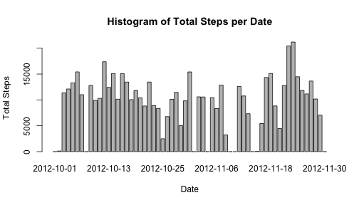
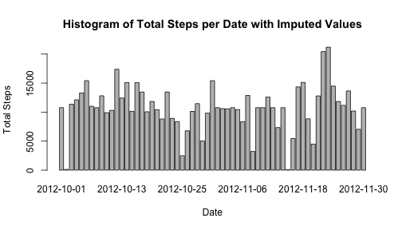
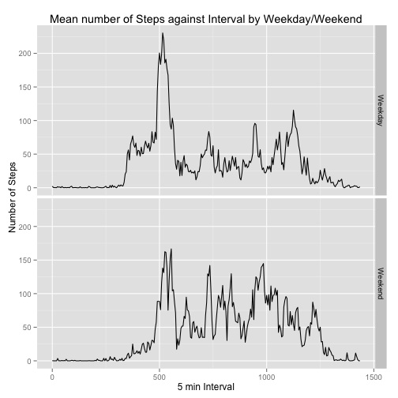

Peer Assessment 1
========================================================

## Set working directory

```r
setwd("/Users/GaryLo/Desktop/Data Science Specialization/Reproducible Research/Peer Assessment 1")
```

## Loading necessary packages

```r
install.packages("knitr")
```

```
## Error: trying to use CRAN without setting a mirror
```

```r
library(knitr)
install.packages("ggplot2")
```

```
## Error: trying to use CRAN without setting a mirror
```

```r
library(ggplot2)
```

## Set Global Options

```r
opts_chunk$set(echo = TRUE)
```

## Downloading/Unzipping Data and checking if file exists.

```r
url = "https://d396qusza40orc.cloudfront.net/repdata%2Fdata%2Factivity.zip"
if (file.exists("repdata-data-activity.zip")){
    #skip download step
}else{
    download.file(url,"repdata-data-activity.zip",method="curl")
}
if (file.exists("activity.csv")){
        #skip unzip step
    }else{
        unzip("repdata-data-activity.zip")    
}
```

## Reading in data.

```r
data = read.csv("activity.csv")
```

## Formating date variable to Date type and interval variable to contigous mins.

```r
data$date = as.Date(data$date, format = "%Y-%m-%d")
data$interval_hours = as.integer(data$interval/100)
data$interval_mins = data$interval - data$interval_hours*100
data$cont_mins = data$interval_hours*60 + data$interval_mins
```

## What's the Total/Mean/Median number of steps per day (ignoring NA values)?

```r
measureDF = data.frame(matrix(nrow=length(unique(data$date)),ncol=4))
names(measureDF) = c("Date","TotalSteps","Mean","Median")
measureDF$Date = unique(data$date)
measureDF$TotalSteps = 0
measureDF$Mean = 0
measureDF$Median = 0

for (i in 1:nrow(measureDF)){
    subset = data[data$date == measureDF$Date[i],] #subsetting for each date.
    subset = subset[!is.na(subset$steps),] #removing observations with NA steps
    if (nrow(subset)==0){
        #skip, all steps were NA
    }else{
        measureDF$TotalSteps[i] = sum(subset$steps)
        measureDF$Mean[i] = mean(subset$steps)
        measureDF$Median[i] = median(subset$steps)
    }
}
overallMean = mean(measureDF$TotalSteps)
overallMed = median(measureDF$TotalSteps)
```
**The overall mean is 9354.2295 and the overall median is 1.0395 &times; 10<sup>4</sup>.**  

## Histogram of Total Steps per day

```r
barplot(measureDF$TotalSteps,main="Histogram of Total Steps per Date",ylab = "Total Steps", xlab = "Date", names.arg=measureDF$Date)
```

 

## What is the daily average activity pattern?

```r
uniqueIntervals = unique(data$cont_mins)
activityDF = data.frame(matrix(nrow=length(uniqueIntervals), ncol = 3))
names(activityDF) = c("Intervals","TotalSteps","MeanSteps")
activityDF$Intervals = uniqueIntervals

for (i in 1:nrow(activityDF)){
    subset2 = data[data$cont_mins == activityDF$Intervals[i],] #subset for intervals.
    subset2 = subset2[!is.na(subset2$steps),] #removing observations with NA steps
    if (nrow(subset2)==0){
        #skip, all steps were NA
    }else{
        activityDF$TotalSteps[i] = sum(subset2$steps)
        activityDF$MeanSteps[i] = mean(subset2$steps)
    }
}
with(activityDF,plot(Intervals,MeanSteps,type="l",main="Plot of Interval against Mean Steps"))
```

 

```r
highAvg = activityDF[activityDF$MeanSteps == max(activityDF$MeanSteps),]$Intervals
```
**The 5-minute interval with the highest average number of steps is: 515** 

## Total number of rows in dataset with NA's.

```r
numNA = nrow(data)-sum(complete.cases(data))
```
**Total number of rows in dataset with NA's: 2304.**  

## Imputing missing values by using mean number of steps on that interval.

```r
fullData = data
for (i in 1:nrow(fullData)){
    if (is.na(fullData$steps[i])){
        # impute value
        fullData$steps[i] = activityDF[activityDF$Intervals == fullData$cont_mins[i],]$MeanSteps
    }else{
        # populated value - no need to impute
    }
}
newNumNA = nrow(fullData)-sum(complete.cases(fullData))
```
**The new number of NA's in the imputed dataset is 0.**  

## Histogram of Total Steps per day with fullData set (with imputed values)

```r
fullDF = data.frame(matrix(nrow=length(unique(fullData$date)),ncol=4))
names(fullDF) = c("Date","TotalSteps","Mean","Median")
fullDF$Date = unique(fullData$date)
fullDF$TotalSteps = 0
fullDF$Mean = 0
fullDF$Median = 0

for (i in 1:nrow(fullDF)){
    subset3 = fullData[fullData$date == fullDF$Date[i],] #subsetting for each date.
    subset3 = subset3[!is.na(subset3$steps),] #removing observations with NA steps
    if (nrow(subset3)==0){
        #skip, all steps were NA
    }else{
        fullDF$TotalSteps[i] = sum(subset3$steps)
        fullDF$Mean[i] = mean(subset3$steps)
        fullDF$Median[i] = median(subset3$steps)
    }
}
barplot(fullDF$TotalSteps,main="Histogram of Total Steps per Date with Imputed Values",ylab = "Total Steps", xlab = "Date", names.arg=fullDF$Date)
```

 


```r
newOverallMean = mean(fullDF$TotalSteps)
newOverallMed = median(fullDF$TotalSteps)
```
**The imputed overall mean is 1.0766 &times; 10<sup>4</sup> and the imputed overall median is 1.0766 &times; 10<sup>4</sup>.**  
**Both the new imputed means and medians are higher than the non-imputed values.**  

## Are there differences between weekends and weekdays?  Creating new factor variable

```r
for (i in 1:nrow(fullData)){
    if (weekdays(fullData$date[i])=="Saturday" | weekdays(fullData$date[i])=="Sunday"){
        fullData$weekday[i] = "Weekend"
    }else{
        fullData$weekday[i] = "Weekday"
    }
}
fullData$weekday = as.factor(fullData$weekday)
```


```r
fullActivityDF = data.frame(matrix(nrow=length(uniqueIntervals), ncol = 3))
names(fullActivityDF) = c("Intervals","TotalSteps","MeanSteps")
fullActivityDF$Intervals = uniqueIntervals
fullActivityWeekdayDF = fullActivityDF
fullActivityWeekendDF = fullActivityDF

for (i in 1:nrow(fullActivityWeekdayDF)){
    subset4 = fullData[fullData$cont_mins == fullActivityWeekdayDF$Intervals[i],]#subset for intervals.
    subset4 = subset4[subset4$weekday == "Weekday",] #subset for weekdays
    subset4 = subset4[!is.na(subset4$steps),] #removing observations with NA steps
    if (nrow(subset4)==0){
        #skip, all steps were NA
    }else{
        fullActivityWeekdayDF$TotalSteps[i] = sum(subset4$steps)
        fullActivityWeekdayDF$MeanSteps[i] = mean(subset4$steps)
    }
}
fullActivityWeekdayDF$Weekday = "Weekday"

for (i in 1:nrow(fullActivityWeekendDF)){
    subset5 = fullData[fullData$cont_mins == fullActivityWeekendDF$Intervals[i],]#subset for intervals.
    subset5 = subset5[subset5$weekday == "Weekend",] #subset for weekdays
    subset5 = subset5[!is.na(subset5$steps),] #removing observations with NA steps
    if (nrow(subset5)==0){
        #skip, all steps were NA
    }else{
        fullActivityWeekendDF$TotalSteps[i] = sum(subset5$steps)
        fullActivityWeekendDF$MeanSteps[i] = mean(subset5$steps)
    }
}
fullActivityWeekendDF$Weekday = "Weekend"
```

## Panel plot comparing weekdays and weekends.

```r
fullActivityAllDaysDF = rbind(fullActivityWeekdayDF,fullActivityWeekendDF)
g = ggplot(fullActivityAllDaysDF,aes(Intervals,MeanSteps))
g + geom_line() + facet_grid(Weekday~.) + labs(x="5 min Interval", y = "Number of Steps", title = "Mean number of Steps against Interval by Weekday/Weekend")
```

 

